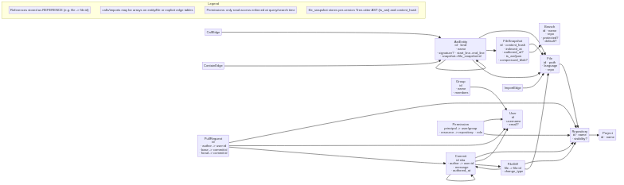

# Data model: SurrealDB mapping for repo-index

This document describes the planned SurrealDB data model for the Tree-sitter repo indexer and the related SCM lifecycle objects (users, groups, projects, repositories, commits, PRs, diffs). It focuses on using `REFERENCE` relations and on read-access permissions (the only permission type we currently need to enforce at query time).

## Goals
- Represent Tree-sitter entities and code graph (calls/imports/containment) with REFERENCEs or edge tables.
- Model SCM lifecycle objects (user/group/project/repository/pull_request/commit/file_diff) so we can answer search-time access checks.
- Keep modeling choices pragmatic: prefer REFERENCE arrays on objects for simplicity, add edge tables if/when we need analytics or metadata on edges.

## Principle: use REFERENCEs for links
- Use SurrealDB REFERENCEs to link records (for example `file -> file:abcd` or `entity.parent -> entity:123`).
- REFERENCE fields can be single values or arrays for one-to-many relations.
- REFERENCEs keep the dataset normalized and make graph traversal queries straightforward.

## Core tables and fields (starter)

Notes on notation: `->` denotes a REFERENCE. Fields marked `[idx]` should be indexed.

- `file`
  - id (Surreal id)
  - path: string [idx]
  - repo -> repository:id
  - language: string
  - indexed_at: datetime

- `branch`
  - id
  - name: string [idx]           # e.g. "main", "feature/x"
  - repo -> repository:id
  - protected: bool
  - default: bool

- `file_snapshot` (a versioned view of a file)
  - id
  - file -> file:id
  - branch -> branch:id?         # optional: which branch this snapshot belongs to
  - commit -> commit:id?         # preferred source of truth for exact content
  - content_hash: string [idx]
  - ts_ast: json                   # serialized Tree-sitter representation (JSON)
  - ts_ast_compressed: blob        # optional compressed blob for storage efficiency
  - indexed_at: datetime
  - authored_at: datetime?        # optional commit authored time
  - note: string?                 # optional human note (e.g. why this snapshot was taken)

- `entity` (an AST entity: file/class/function/method/other)

  - file -> file:id
  - snapshot -> file_snapshot:id?  # which file/version this entity belongs to

  See the standalone diagram in `doc/diagram.mmd` for a Mermaid visualization of the model.

4. Use a transaction for the group of upserts related to a single file so you don't leave dangling references.

Example (pseudo-SurrealQL):

-- find-or-create file
LET $f = SELECT * FROM file WHERE path = "src/lib.rs";
IF is_empty($f) {
  LET $f = CREATE file CONTENT { path: "src/lib.rs", repo: repository:abc, language: "rust", indexed_at: time::now() };

Notes on storing Tree-sitter per-version
- Primary approach: persist a `file_snapshot` record for each version we want to retain (commit or branch tip). Store the serialized Tree-sitter AST in `ts_ast` (JSON) and optionally a compressed binary in `ts_ast_compressed` when size matters.
- Entity records created while indexing should reference the `file_snapshot` that produced them (via `snapshot -> file_snapshot:id`). This keeps entities tied to a specific file version and makes it easy to answer queries like "what entities existed in commit X".
- Alternatives & optimizations:
  - Store only a compressed AST blob and re-parse into entities on demand for older snapshots (saves space, costs CPU on reads).
  - Keep entity records normalized (one row per entity per snapshot) when you need fast historical queries or blame-style lookups.
  - Use `content_hash` and `commit` to deduplicate snapshots: if the content hash hasn't changed, reuse the previous `file_snapshot` id for that branch/commit mapping.
- Retention: add a configurable retention policy for `file_snapshot` (e.g., keep N recent snapshots per branch or keep snapshots for release commits only) to control storage growth.
}

-- upsert entity (pseudo)
LET $e = CREATE entity CONTENT {
  file: $f[0].id,
  name: "MyStruct",
  kind: "class",
  signature: "struct MyStruct { ... }",
  start_line: 10,
  end_line: 42
};

-- set calls/imports (if you have other entity/file ids resolved)
UPDATE entity:$e.id CONTENT { calls: [entity:123, entity:456], imports: [file:789] };

(Use transactions/batched statements in the real importer to reduce round-trips.)

## Permissions (read-only access model)

Repository read access is the only permission we care about at query time. The goal: when a user runs a search, return only entities/files in repositories they have at least READ access to.

Schema for permissions (minimal):
- `permission`
  - id
  - principal -> user:id OR group:id (store the REFERENCE to the principal record)
  - resource -> repository:id OR project:id
  - role: string (we only need e.g. `read`, `write`, `admin`)
  - scope: optional string (path prefix) to allow repo-subpath permissions

Membership resolution:
- Prefer explicit `permission` rows for users and groups. Also keep `group.members` or a membership table to resolve group membership.
- Permission resolution algorithm for read checks (at query time):
  1. If repository has an explicit `permission` record for the user -> honor it (if role includes `read`).
  2. Else, check group permissions: find groups the user belongs to, and check `permission` records for those groups on the repository.
  3. Else, if repository.inherit_permissions == true, check the parent `project` permission records (user then groups).
  4. If any matching permission grants `read`, the user may view the repo results.

Practical query-time strategies
- Option A (fast, eventually consistent): maintain a materialized `repo_readers` table that stores `user -> repository` pairs for all users with read access (update it when permissions change). This makes search-time filtering a simple JOIN or WHERE IN check.
- Option B (computed on demand): when running a search, include a subquery that filters repositories by the permission resolution logic. Simpler but may be slower for large permission sets.

Example permission check (pseudo):
SELECT repository.id FROM repository WHERE (
  EXISTS (SELECT * FROM permission WHERE resource = repository.id AND principal = user:alice AND role = 'read')
  OR EXISTS (SELECT * FROM permission WHERE resource = repository.id AND principal IN (user:alice.groups) AND role = 'read')
  OR (repository.inherit_permissions AND /* check project-level perms */)
)

Performance notes
- If you expect many users and many repos, precompute effective read lists (Option A) and index them for fast lookup. If the permission dataset is small, Option B (compute on demand) is acceptable.
- Use appropriate indexes on `permission.principal` and `permission.resource`.

## Graph queries you will want
- Entities that call a given entity (follow `calls` REFERENCEs or `call` edge table).
- Files changed by a PR (join `pull_request` -> head commit -> commit.changed_files -> file_diff -> file).
- Which repositories a user can search (use the permission resolution logic above).

## Diagram

See `doc/diagram.mmd`

PNG export (checked into repo):



To regenerate the PNG in the devcontainer:
```bash
npx -y @mermaid-js/mermaid-cli@10.9.1 --puppeteerConfigFile doc/puppeteer.json -i doc/diagram.mmd -o doc/diagram.png --backgroundColor dark
```

## AST snapshot schema (debug / offline snapshot format)

This section describes the AST interchange schema used by the indexer for debug snapshots and offline inspection. The snapshot format is intended for fixtures, tests, and replay; the indexer will write directly to SurrealDB in normal operation.

Purpose
- The repo-indexer writes directly to SurrealDB in normal operation.
- The AST snapshot format is a convenient, portable snapshot format for debugging, offline inspection, test fixtures, and replay.

Format
- The snapshot interchange format used by the project is JSON-based, one-object-per-line (commonly stored as .jsonl files for portability). Consumers can also use other newline-safe encodings; the schema below describes the JSON shape.

Line number conventions
----------------------

- Internal representation: all Tree-sitter-derived coordinates (for example, entity
  `start_line`/`end_line`) are stored 0-based matching Tree-sitter's `row` value.
- Export boundary: when emitting JSONL or writing to external systems (CLI output,
  SurrealDB exports for UI consumption), the exporter MUST convert these to 1-based
  line numbers to match IDE/editor conventions. This avoids surprising off-by-one
  behavior for consumers while keeping internal computations consistent.

Be explicit about conversion responsibilities when adding new export paths or
APIs: prefer a single conversion site at the top-level exporter rather than
scattering +1 adjustments across the codebase.

Top-level fields (recommended)
- file_path: string
- repo: repository id or short name
- branch: optional string
- commit: optional commit id (SHA)
- content_hash: string (sha256 or similar) — useful to deduplicate snapshots
- indexed_at: RFC3339 datetime
- ts_ast: (object) the serialized Tree-sitter AST for the file (JSON)
- entities: array of entity objects (a flattened convenience view derived from the AST)
  - id: string (local identifier unique within this file snapshot)
  - kind: string
  - name: string
  - signature: string
  - start_line: int
  - end_line: int
  - parent: optional id (local)
  - calls: optional array of target ids (local) or fully-qualified entity refs
  - imports: optional array of file paths or file ids
  - doc: optional string

Notes
- The `ts_ast` field contains the full Tree-sitter JSON representation for the file. Keep it compact but avoid lossy transformations if you plan to rehydrate entities from the AST.
- `entities` is a convenience projection; the indexer may compute entities from `ts_ast` when ingesting.
- Prefer `content_hash` + `commit` for deterministic deduplication of snapshots.

Example snapshot line (JSON)

{
  "file_path": "src/lib.rs",
  "repo": "my-org/my-repo",
  "branch": "main",
  "commit": "a1b2c3d4e5f6",
  "content_hash": "sha256:abcd...",
  "indexed_at": "2025-08-22T00:00:00Z",
  "ts_ast": { "type": "source_file", "children": [ /* ... tree-sitter JSON ... */ ] },
  "entities": [
    {
      "id": "e1",
      "kind": "function",
      "name": "compute",
      "signature": "fn compute(x: i32) -> i32",
      "start_line": 10,
      "end_line": 20,
      "parent": null,
      "calls": ["e2"],
      "imports": ["src/util.rs"],
      "doc": "Compute something"
    }
  ]
}

Usage notes
- Use this snapshot format for fixtures, tests, and replay. The primary ingestion path remains direct writes to SurrealDB; snapshot files are a helpful debug/backup format.

Schema evolution
- Keep the schema backward compatible. Add new optional fields instead of renaming or removing fields.
